# CS Tools — Feature Explorer

Admin utilities for ThoughtSpot, fully mapped for a web rewrite. 12 features, 25+ commands, 14 syncer backends.

This document is a Markdown port of `feature-explorer.html` so it's easy for LLMs (and humans) to read end-to-end without running the interactive page. Each feature includes:

- **Purpose** — technical one-liner
- **Plain English** — what it actually does
- **Why it matters** — business impact
- **Commands** — every CLI subcommand and what it does
- **End-to-end flow** — Mermaid flowchart
- **API call sequence** — Mermaid sequence diagram
- **Step-by-step** — numbered runtime steps with API endpoints
- **Edge cases & notes**
- **Web version — architecture decisions** (CLI today, options A/B/C, recommendation)

Tags legend: `read` · `write` · `delete` · `tui` (terminal UI) · `admin` (privileged).

---

## Table of contents

1. [Archiver](#1-archiver)
2. [Bulk Deleter](#2-bulk-deleter)
3. [Bulk Sharing](#3-bulk-sharing)
4. [Extractor](#4-extractor)
5. [Falcon Sharding](#5-falcon-sharding)
6. [Git Integration](#6-git-integration)
7. [Remote TQL (rtql)](#7-remote-tql-rtql)
8. [Remote tsload (rtsload)](#8-remote-tsload-rtsload)
9. [Scriptability (TML)](#9-scriptability-tml)
10. [Searchable ⭐ (flagship)](#10-searchable--flagship)
11. [User Management](#11-user-management)
12. [Syncers (I/O layer)](#12-syncers-io-layer)

---

## 1. Archiver

**Emoji:** 🗑️ · **Tags:** `read`, `write`, `delete`

**Purpose:** Identify, tag, and remove stale (inactive or unmodified) user-generated Answers and Liveboards. Produces an auditable report.

**Plain English:** Marie Kondo for ThoughtSpot. Finds reports and dashboards that nobody has opened in 100+ days, labels them as inactive, and — after you approve — deletes them. Keeps the system from turning into a junk drawer of abandoned content.

**Why it matters:** Clutter makes search results worse, slows down users, and wastes admin time. A typical customer has thousands of old Answers no one remembers creating.

### Commands

- **identify** — STEP 1: find stale dashboards and stick an `INACTIVE` label on them. Does NOT delete anything yet — it just labels, so admins can review the list first.
- **remove** — STEP 2 (destructive): actually delete everything that has the INACTIVE label on it. Can export a TML backup first if you want a safety net.
- **untag** — STEP 2 alternate (the "undo"): delete the INACTIVE label itself. Deleting a label in ThoughtSpot automatically strips it off everything it was attached to, in ONE API call. The dashboards themselves are NOT deleted — only the label is gone. Use this when `identify` labeled things by mistake.

### End-to-end flow

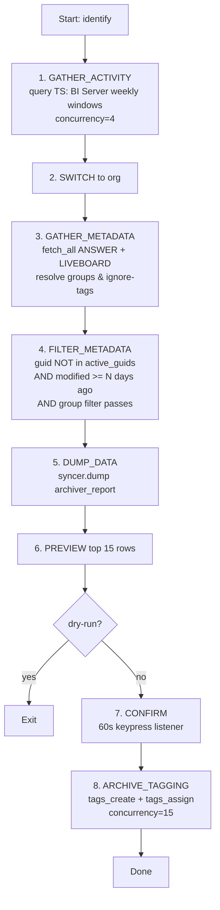

### API call sequence

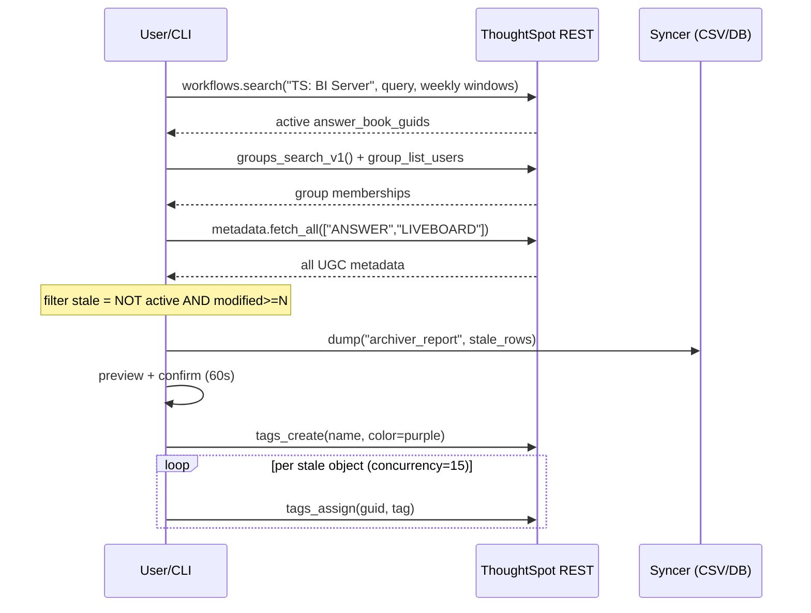

### Step-by-step

1. Determine cluster timezone (UTC on cloud, cluster TZ on Falcon). Lifetime probe: `min([Timestamp])` from `TS: BI Server` if `--recent-activity` is unset.
2. Issue weekly windowed searches against the `TS: BI Server` worksheet, filtering out `user_action=answer_unsaved` and null `answer_book_guid`. — `POST /api/rest/2.0/searchdata`
3. Switch org (optional). — `ts.switch_org(org_id)`
4. If `--only-groups` / `--ignore-groups`: enumerate groups and their members. — `GET /tspublic/v1/group + /tspublic/v1/group/{id}/users`
5. Fetch all matching Answers + Liveboards with pagination. — `POST /api/rest/2.0/metadata/search`
6. Apply filter: `guid NOT in active_guids AND (today - last_modified) >= --recent-modified days (default 100) AND author in/not-in chosen groups AND no ignored tag`.
7. Dump filtered rows to syncer as `ArchiverReport(operation="IDENTIFY")`. — `syncer.dump("archiver_report", data)`
8. Preview top 15 rows as a Rich table (TYPE / NAME / AUTHOR / MODIFIED days-ago).
9. 60-second confirmation prompt with tick-tock countdown. `N` aborts.
10. Create the tag. — `POST /api/rest/2.0/tags/create (name, color=purple)`
11. Parallel tag-assign across all stale objects. — `POST /api/rest/2.0/tags/assign (concurrency=15)`

### Edge cases & notes

- `remove` flow: `fetch_all` tagged → optional parallel TML YAML export (concurrency=4) → `metadata_delete` in reverse (tag GUID last) at concurrency=15.
- `--only-groups` and `--ignore-groups` are mutually exclusive.
- Tag name lookup is case-sensitive.
- Ignores system-owned content through search-token filters.
- Requires the `TS: BI Server` embedded worksheet to be present.

### Web version — architecture decisions

**How the CLI does it today:** Admin runs the CLI on their laptop; it calls ThoughtSpot REST, picks stale content, and tags/deletes it with a 60-second keyboard confirmation.

- **A. Interactive web flow** — Admin clicks "Find stale", sees a preview table, clicks "Archive". The most natural translation of the CLI — a preview + approve button instead of a keyboard prompt.
- **B. Scheduled with email approval** — "Run identify every Monday, email me the list, only delete after I click Approve in the email." Set-and-forget for the admin, but still human-in-the-loop for safety.
- **C. Fully automated** — Identify + tag + delete on a cron with no human in the loop. Fast, but one bad config and you nuke real content.

**Recommendation:** Ship A first (interactive with preview). Add B (scheduled + email approval) as the enterprise upsell — that's the real "set it and forget it" value. Never ship C unless a customer signs a written waiver; the mistake surface is too large.

---

## 2. Bulk Deleter

**Emoji:** 💣 · **Tags:** `delete`, `read`

**Purpose:** Mass-delete metadata by (a) dependency of a root GUID, (b) everything tagged, or (c) a list loaded from a Syncer.

**Plain English:** A mass-delete button with three ways to pick your victims: "delete everything that uses this thing", "delete everything with this label", or "delete this exact list I gave you". Can export a backup copy before it deletes.

**Why it matters:** When a team leaves or a project wraps up, admins need to clean up dozens or hundreds of related objects. Deleting them one-by-one in the UI is unthinkable; this does it in one command with a safety preview.

### Commands

- **downstream** — Point at ONE root object (like a worksheet) and delete everything that uses it — all the dashboards and Answers built on top of it. The root itself is NOT deleted. Good for "we're retiring this data source, kill everything that depends on it".
- **from-tag** — Delete everything with a specific label. Can export a TML backup first. `--tag-only` skips the delete and just removes the label itself (safety undo, like archiver's `untag`).
- **from-tabular** — Delete an exact list of things. You provide a CSV/spreadsheet containing the GUIDs to kill; this deletes exactly those. Good for "here's the list from legal, delete these specific items".

### End-to-end flow

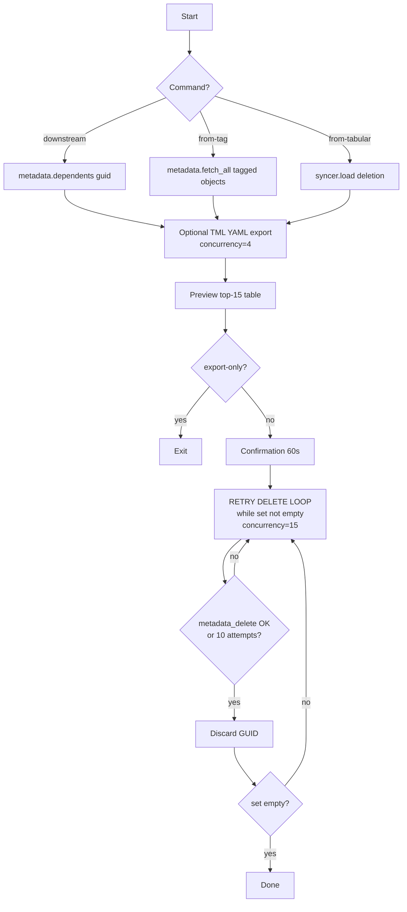

### API call sequence

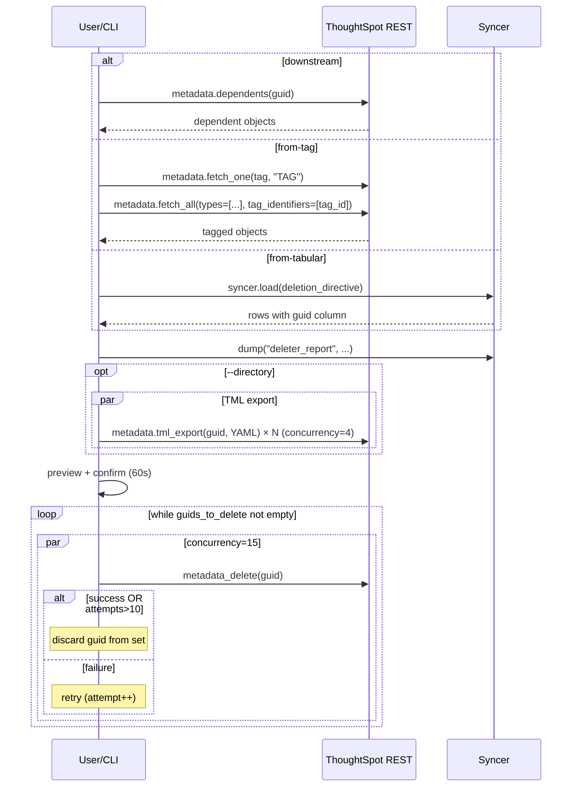

### Step-by-step

1. Resolve the target set depending on command: dependents, tagged, or tabular. — `metadata.dependents / metadata.fetch_all / syncer.load`
2. Dump working set to syncer as `DeleterReport`. — `syncer.dump("deleter_report", data)`
3. Optionally export TML (YAML) to `--directory` at concurrency=4. — `POST /api/rest/2.0/metadata/tml/export`
4. Preview top-15 + confirm (60s).
5. Delete loop: while pending set not empty, run `bounded_gather` at concurrency=15. Each GUID retries up to 10 attempts before being discarded. — `POST /api/rest/2.0/metadata/delete`
6. `from-tag` with `--tag-only` skips object delete and only removes the tag. — `POST /api/rest/2.0/tags/delete`

### Edge cases & notes

- Retry is silent — no explicit backoff; relies on the 15-wide concurrency ceiling to pace.
- `downstream` does NOT delete the root GUID.
- `from-tag` (non-tag-only) does NOT delete the tag itself either.
- `--export-only` requires `--directory`.
- TML export concurrency is smaller (4) because payloads are larger than deletes.

### Web version — architecture decisions

**How the CLI does it today:** Admin supplies GUIDs/tag/list on the command line, confirms once, CLI hard-deletes via REST with silent retries.

- **A. Preview + confirm web UI** — User pastes a list or picks a tag, sees exactly what will be deleted in a table, clicks one button. Much safer than the CLI because the preview is visual and clickable.
- **B. Soft-delete / Trash bin (recoverable)** — Instead of hard-deleting, move to a "Trash" tag for 30 days, then auto-hard-delete. Gives admins an undo window — huge trust builder.
- **C. API-driven** — Expose an endpoint other internal systems (HR, ticketing) can call to trigger deletes programmatically.

**Recommendation:** A + B together. The Trash window is your killer differentiator — every admin is terrified of mass-delete, and this removes the fear. Skip C until a partner explicitly asks for the API.

---

## 3. Bulk Sharing

**Emoji:** 🔐 · **Tags:** `write`, `tui`

**Purpose:** Column-level security (CLS) matrix editor via Textual TUI, plus a one-shot CLI to share all tagged objects to groups.

**Plain English:** A permissions spreadsheet. Rows are table columns (like "SSN" or "Salary"), columns are user groups (like "HR" or "Finance"), and each cell is a click-to-cycle setting: "no access", "can see", or "can edit". Also has a shortcut: "share everything tagged X with groups A and B".

**Why it matters:** Setting permissions column-by-column in the native UI is a nightmare — especially for tables with 50+ columns. A matrix view is how admins actually think about it.

### Commands

- **cls-ui** — Opens the permissions spreadsheet — rows are table columns, columns are user groups, cells are click-to-cycle access levels (none → read → edit). `--mode web` opens it in a browser; `--mode terminal` keeps it inside your terminal. For when you have 50 columns × 10 groups and clicking in the native UI is unbearable.
- **from-tag** — One-shot share: "every object with label X, share it with groups A and B at access level Y". No UI — one command, one call. Good for "all FINANCE-tagged dashboards, share with the Finance team at Read-Only".

### End-to-end flow

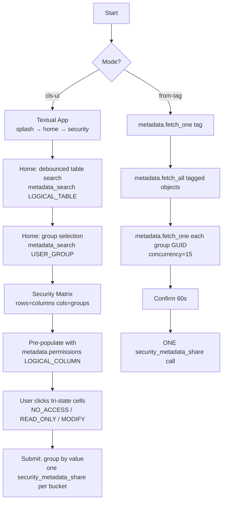

### API call sequence

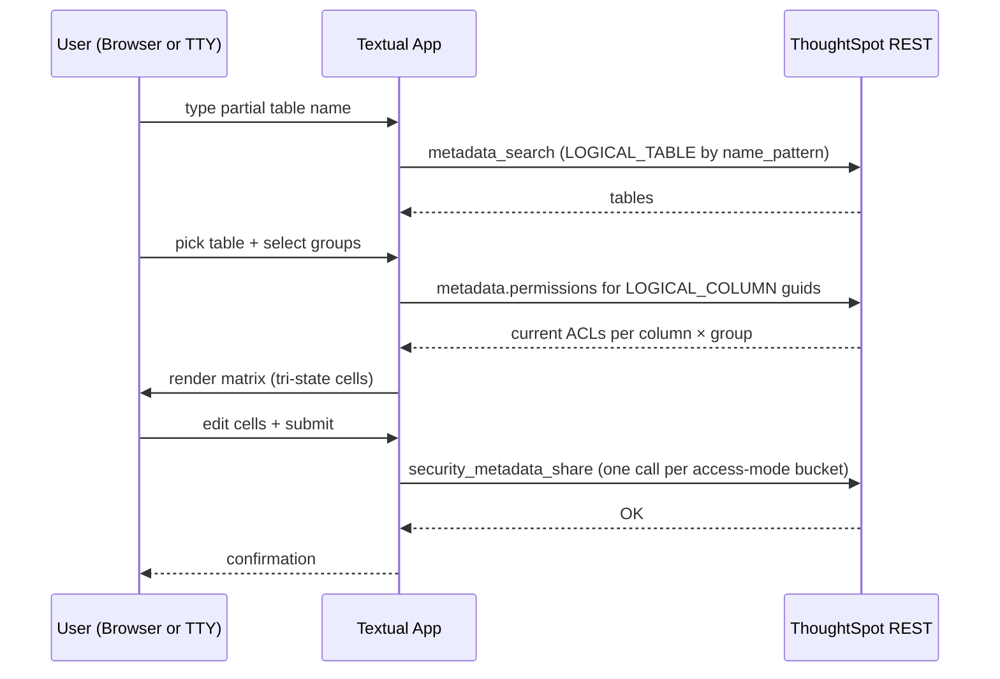

### Step-by-step

1. `cls-ui --mode web` spawns a `textual_serve.server.Server` wrapping `tui.py` — every session re-auths from `CSToolsConfig` so the browser inherits current creds.
2. Home screen: `DebouncedInput` (0.5s delay) + `RadioSet` for tables; `SelectionList` for groups. Fed by `metadata_search`. — `POST /api/rest/2.0/metadata/search (include_details=True, include_hidden_objects=True, record_size=-1)`
3. Security screen: rows = `metadata_detail.columns`, cols = chosen groups.
4. Pre-populate cells by reading existing ACLs. — `workflows.metadata.permissions(typed_guids={"LOGICAL_COLUMN": column_guids})`
5. On submit, cells are bucketed by chosen `share_mode` and ONE call per bucket is made in parallel. — `POST /api/rest/2.0/security/metadata/share`
6. `from-tag`: single `security_metadata_share` call covering all tagged objects × all groups. — `POST /api/rest/2.0/security/metadata/share`

### Edge cases & notes

- Groups marked `metadata_detail.visibility == "NON_SHARABLE"` are dimmed but selectable.
- Table icons are letters W/M/V/S/U/T driven by `metadata_header.type`.
- Modes available: `NO_ACCESS`, `READ_ONLY`, `MODIFY`.

### Web version — architecture decisions

**How the CLI does it today:** Admin opens a terminal matrix UI (columns × groups) and clicks cells to cycle access levels. CLI one-shot for tagged-object sharing.

- **A. Web matrix editor** — Port the terminal grid to a proper web data-grid with column filtering, keyboard navigation, multi-select. Core feature — this is what the CLI does, just nicer.
- **B. Rules engine** — "Any object tagged FINANCE auto-shares to the Finance group at Read-Only." Set policy once, it applies forever as content gets tagged. Turns a one-time chore into automation.
- **C. Request / approval flow** — End-users request access to a dashboard, admins approve in a queue. Enterprise feature.

**Recommendation:** A is the baseline. B (rules engine) is the real differentiator — admins will pay significantly more for policy-driven permissions vs. clicking cells. C only if you're selling to orgs >1000 users.

---

## 4. Extractor

**Emoji:** 📤 · **Tags:** `read`

**Purpose:** Run a ThoughtSpot Search query against a worksheet/view/model and pipe the rows to any Syncer destination.

**Plain English:** A "save this search result to a file" button, but scriptable. You write a ThoughtSpot search once (like "revenue by region this quarter"), and this runs it on demand and dumps the rows to a CSV, Excel file, Google Sheet, Snowflake table — wherever.

**Why it matters:** Business users constantly ask "can you email me this report every Monday?". Without this, an admin screenshots a dashboard. With this, they schedule a cron job and forget about it.

### Commands

- **search** — The only command. You give it: (1) which worksheet/model to query, (2) the search string in ThoughtSpot's search syntax (like `[revenue] by [region] this quarter`), (3) where to save the results (CSV file? Snowflake table? Google Sheet?). It runs the search and writes the rows. Re-run it on a schedule and you've got automated reports.

### End-to-end flow

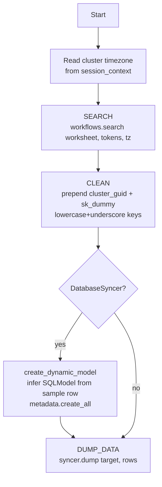

### API call sequence

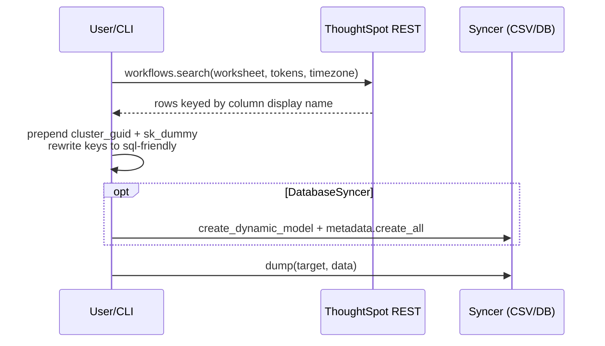

### Step-by-step

1. Read cluster TZ from `ts.session_context.thoughtspot.timezone`.
2. Execute search. — `POST /api/rest/2.0/searchdata` (wrapped by `workflows.search(...)`)
3. Prepend `cluster_guid` (from `session_context.thoughtspot.cluster_id`) and `sk_dummy = "{cluster_id}-{row_idx}"` to every row.
4. If `--sql-friendly-names` (default on): lowercase + replace spaces with underscores in keys.
5. If the syncer is a `DatabaseSyncer`, auto-build a SQLModel from the first row and create the table if missing.
6. Dump rows. — `syncer.dump(target, data)`

### Edge cases & notes

- Non-destructive — no dry-run, no confirmation.
- No explicit pagination — relies on Search Data API response cap (very large queries may truncate).
- `--original-names` preserves spaces and case which may break DB column names.
- Search-level formulas are NOT supported; only data-source formulas work.

### Web version — architecture decisions

**How the CLI does it today:** Admin writes a search-token string, picks a destination, runs once. No scheduling, no saved queries.

- **A. One-shot search + download** — Paste tokens, pick dataset, click Run, download CSV/Excel. Simplest possible version.
- **B. Saved queries + schedules** — Name a query, schedule it (hourly/daily/weekly), email the file or push to a destination automatically. This is the high-value use case.
- **C. Visual query builder** — Drag-and-drop columns and filters instead of typing search tokens. Much friendlier for non-technical users but a big build.

**Recommendation:** A + B. The "scheduled report in my inbox every Monday" use case is what admins actually pay for. C is a significant investment — skip until users explicitly ask for it.

---

## 5. Falcon Sharding

**Emoji:** 🪓 · **Tags:** `read`, `write`, `admin`

**Purpose:** Software-only (Falcon DB) sharding recommender. Gathers per-table stats from a private internal endpoint and deploys a pre-built SpotApp that applies sharding heuristics.

**Plain English:** A performance tuning assistant for on-prem ThoughtSpot. Looks at how big your tables are and how they're split across servers, then tells you which ones need to be re-partitioned ("sharded") so queries run fast. Only useful for customers hosting ThoughtSpot themselves, not SaaS.

**Why it matters:** Badly-sharded tables are the #1 cause of slow queries on on-prem clusters. Figuring out the right shard count by hand requires a spreadsheet and deep product knowledge. This gives you a dashboard that does the math.

### Commands

- **deploy** — Install the pre-built Sharding Recommender kit (a Liveboard + Worksheet + Table) into your ThoughtSpot. You give it your cluster size parameters (node count, CPU per node, target rows-per-shard) and it customizes the dashboard to match. Run once per cluster.
- **metadata** (alias `gather`) — Pull the raw table stats from the cluster's private diagnostic endpoint — size, row count, shard count, skew — and save them to your warehouse. Run on a schedule; the `deploy` dashboard reads these rows and shows recommendations.

### End-to-end flow

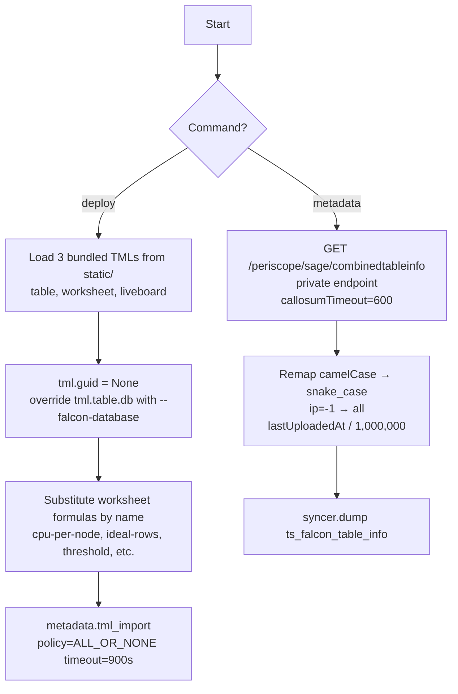

### API call sequence

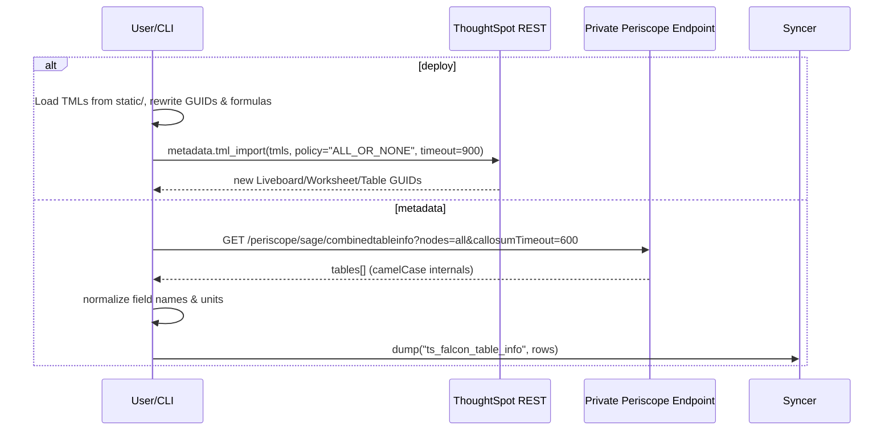

### Step-by-step

1. `deploy`: iterate `static/*.tml`, pick Table/Worksheet/Liveboard via `determine_tml_type`.
2. Force new GUIDs: `tml.guid = None`. Table TML: override `.table.db` with `--falcon-database`.
3. Worksheet TML: iterate formulas and replace `.expr` by matching display name against parameter dict (CPU per Node, Ideal Rows per Shard, Threshold, Min/Max Rows).
4. Import as a batch. — `POST /api/rest/2.0/metadata/tml/import (policy=ALL_OR_NONE, timeout=15m)`
5. `metadata`: hit the private Periscope endpoint — this powers Admin → System → Table Status. — `GET /periscope/sage/combinedtableinfo?nodes=all&callosumTimeout=600`
6. Normalize fields (camelCase → snake_case), `ip == -1` → `"all"`, `lastUploadedAt` microseconds → seconds.
7. Dump to `ts_falcon_table_info`.

### Edge cases & notes

- Private endpoint only exists on Falcon/Software — USELESS on Cloud.
- Double timeout protection: `callosumTimeout=600` server-side, httpx `timeout=600` client-side.
- Defaults: `--nodes` required, `--cpu-per-node=56`, `--threshold=55,000,000` rows, `--ideal-rows=20M`, `--min-rows=15M`, `--max-rows=20M`.

### Web version — architecture decisions

**How the CLI does it today:** Hits a private, software-only internal endpoint; installs a bundled Liveboard/Worksheet/Table into the cluster. Only works on on-prem (Falcon) installs.

- **A. Skip entirely in v1** — The feature only works on on-prem (Falcon) ThoughtSpot. Most customers are now on cloud. Unless your target segment is on-prem enterprise, drop it.
- **B. Build it for on-prem customers** — If enterprise on-prem is your market, it's high-value governance — admins hand-tune shards today and it's painful.
- **C. Stats viewer only** — Show the table stats in YOUR UI (no dashboard install into their cluster). Less invasive, still useful.

**Recommendation:** A (skip) for v1 unless on-prem enterprise is a primary segment. The effort-to-audience ratio is bad since ThoughtSpot is moving customers to cloud. Revisit only if an on-prem customer asks.

---

## 6. Git Integration

**Emoji:** 🌿 · **Tags:** `read`, `write`, `admin`

**Purpose:** Wrap ThoughtSpot native Git REST endpoints — configure GitHub per org, commit TML, validate cross-branch merges, deploy from branch.

**Plain English:** Version control for dashboards. Connects your ThoughtSpot environment to a GitHub repo so every change to a dashboard gets committed as a file. Your team can then review changes in pull requests, roll back mistakes, and promote from staging to production the same way they ship code.

**Why it matters:** Today, if someone accidentally breaks a production dashboard, there's no undo. With this, every change is tracked, reviewable, and revertable — the same governance engineers have for code.

### Commands

- **config create** — First-time setup: connect a ThoughtSpot Org to a GitHub repo. You provide the repo URL, your GitHub token, and branch names (which branch gets commits, which branch stores ID mappings). Run once per environment. If already configured, it just warns instead of erroring.
- **config search** — Read-only: show me what's already connected. Lists every Org's GitHub config as a table — repo URL, username, branches. Zero side effects.
- **branches commit** — Push changes FROM ThoughtSpot INTO GitHub. You pick what to send (by type, name pattern, author, or tag), write a commit message, done. Like `git commit -am "..."` but for dashboards. `--delete-aware` also removes files from the repo if they were deleted from ThoughtSpot.
- **branches validate** — Dry-run a merge between two branches. Asks ThoughtSpot "if I merged branch A into branch B, would anything break?" without actually merging. Safety check before `deploy`.
- **branches deploy** — Pull changes FROM GitHub INTO ThoughtSpot. Pick a branch (optionally a specific commit). Three safety levels: `VALIDATE_ONLY` (dry-run, nothing imported), `ALL_OR_NONE` (atomic — everything imports or nothing does), `PARTIAL` (best-effort — import what works, skip what doesn't). Can auto-tag the new content on success.

### End-to-end flow

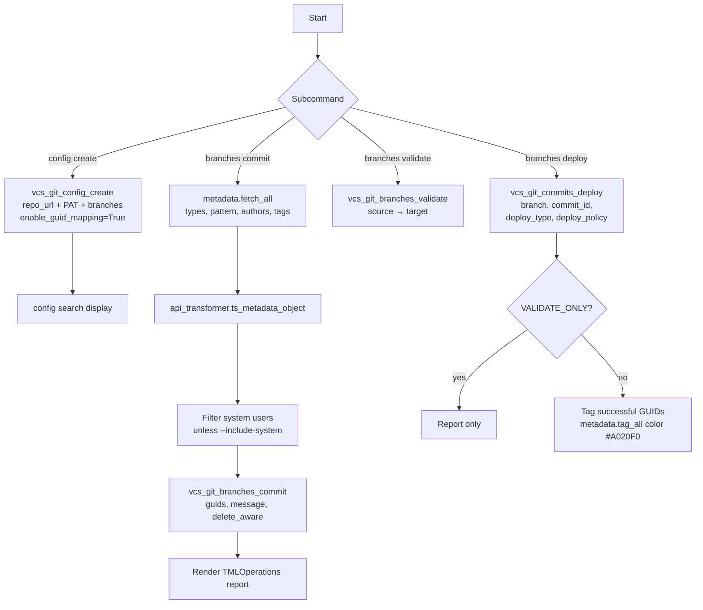

### API call sequence

```mermaid
sequenceDiagram
    participant U as User/CLI
    participant TS as ThoughtSpot REST
    participant G as GitHub Repo
    rect rgb(20,30,50)
      Note over U,TS: config create
      U->>TS: vcs_git_config_create(repo, user, PAT, branches, enable_guid_mapping=True)
      TS->>G: authenticates & validates repo
      TS-->>U: config OK (or 400 already configured, warns)
    end
    rect rgb(30,50,20)
      Note over U,TS,G: branches commit
      U->>TS: metadata.fetch_all(types, pattern, authors, tags)
      TS-->>U: matching objects
      U->>TS: vcs_git_branches_commit(guids, msg, delete_aware)
      TS->>G: push TML to commit_branch (+ update GUID mapping on config_branch)
      TS-->>U: committed_files
    end
    rect rgb(50,20,30)
      Note over U,TS: branches deploy
      U->>TS: vcs_git_commits_deploy(branch, commit_id, type, policy)
      TS->>G: pull TML
      TS->>TS: import TML
      TS-->>U: deploy status
      opt --tags provided AND success
        U->>TS: metadata.tag_all(guids, tags, color=purple)
      end
    end
```

### Step-by-step

1. `config create`: idempotent-ish — if 400 "Repository already configured", warns instead of error. — `POST /api/rest/.../version-control/config/create`
2. `config search`: renders Org / Repository / Username / Commit Branch / Config Branch / GUID Mapping table. — `POST /api/rest/.../version-control/config/search`
3. `branches commit`: resolve `metadata_types` via `FRIENDLY_TO_API` map, fetch matching objects. — `POST /api/rest/2.0/metadata/search`
4. Filter system users unless `--include-system`.
5. Issue the commit. — `POST /api/rest/.../version-control/branches/commit (guids, comment, delete_aware)`
6. `branches validate`: merge dry-run. — `POST /api/rest/.../version-control/branches/validate`
7. `branches deploy`: `--deploy-type DELTA|FULL`, `--deploy-policy ALL_OR_NONE|PARTIAL|VALIDATE_ONLY`. — `POST /api/rest/.../version-control/commits/deploy`
8. If deploy succeeded and `--tags` given, tag the new GUIDs. — `workflows.metadata.tag_all(guids, tags, color=purple)`

### Edge cases & notes

- `-b/--branch` on commit is deprecated — set `commit_branch_name` in the repo config instead.
- `--delete-aware`: objects absent from this commit get deleted in the repo.
- `search-commits` and `revert-commit` are deprecated: they just print the `playgroundV2_0` URL.
- In CI (`session_context.environment.is_ci`) the `TMLOperations` renderer falls back to log-friendly text.

### Web version — architecture decisions

**How the CLI does it today:** Thin wrapper around ThoughtSpot's native Git REST endpoints — config, commit, validate, deploy. The heavy lifting is done server-side by TS.

- **A. Passthrough UI** — Your web app calls TS's Git endpoints; shows config/commit/deploy in a nicer interface than the CLI. Cheap to build because TS already does the hard parts.
- **B. Enhanced diffs + PR-style review** — Build on top with side-by-side TML diffs, approval workflow, who-changed-what history. Real "GitHub for ThoughtSpot" experience.
- **C. Skip — refer users to TS's native UI** — TS ships a native Git UI in playgroundV2. You could just link to it and not build anything.

**Recommendation:** A for v1 (cheap win — TS already does the heavy lifting, you just provide a better UI). B is a strong v2 if customers ask for diff/review workflows. Skip C unless you're cutting scope hard.

---

## 7. Remote TQL (rtql)

**Emoji:** 💻 · **Tags:** `tui`, `admin`

**Purpose:** Interactive TQL (Falcon SQL-like DDL/DML) console that talks to the TQL service over REST — no SSH required.

**Plain English:** A SQL-like console for ThoughtSpot's internal database. Type a query, hit Execute, see results. Normally admins have to SSH into the server to run these commands — this lets them do it from their laptop over a secure connection.

**Why it matters:** Troubleshooting and hot-fixing data issues used to require server access (which security teams hate). This puts the same power behind an auth-gated web/terminal interface.

### Commands

- **interactive** — Open the TQL console. You type a query, hit Execute, see results — like a SQL playground. `--mode web` opens it in a browser; `--mode terminal` keeps it in your terminal. `--admin` (hidden flag) unlocks destructive statements like `DROP TABLE`. You must be a Data Manager in ThoughtSpot to run it at all — otherwise it refuses.

### End-to-end flow

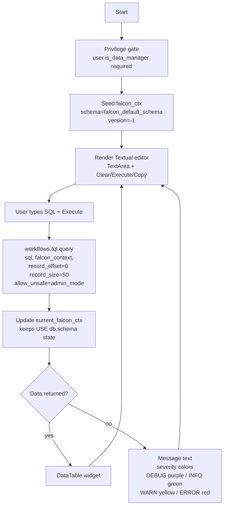

### API call sequence

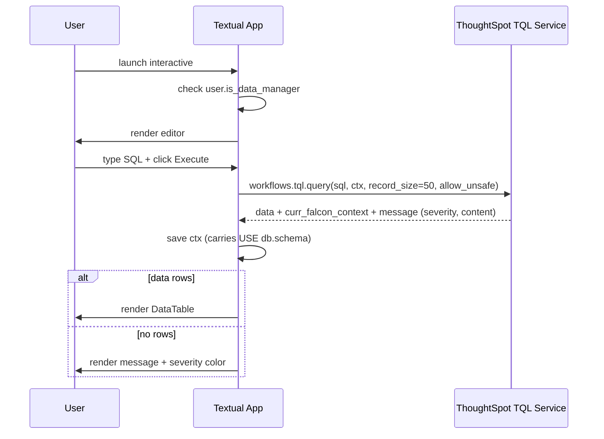

### Step-by-step

1. Command is gated on `ts.session_context.user.is_data_manager` (`can_manage_data`). Denied users get `InsufficientPrivileges`.
2. Initial Falcon context seeded as `{schema: "falcon_default_schema", server_schema_version: -1}`.
3. Editor with Execute/Copy/Clear buttons. Results panel is `Static`/`Pretty`/`DataTable` depending on shape.
4. On Execute: call the TQL service over REST. — `workflows.tql.query → POST (TQL service endpoint)`
5. Response includes the evolved `falcon_context` — saved so subsequent queries keep `USE database.schema` state.
6. `--admin` flips `allow_unsafe=True` so `DROP/DELETE/TRUNCATE` are allowed.

### Edge cases & notes

- `--mode web` spawns `textual_serve.server.Server` wrapping `tui.py` → browser-accessible.
- Results can be copied as JSON-dumped text to clipboard.
- Severity → border color mapping: DEBUG purple, INFO green, WARNING yellow, ERROR red.

### Web version — architecture decisions

**How the CLI does it today:** Textual terminal SQL editor. Admin types TQL, hits Execute, sees results. `--admin` flag unlocks DROP/DELETE.

- **A. Full web SQL editor** — Monaco editor, syntax highlighting, execute button, results table. Admin-only. Parity with the CLI.
- **B. Skip — too much security risk** — A web UI that can DROP tables is a significant liability. Phishing/CSRF → data loss.
- **C. Read-only viewer** — SELECT queries only, no destructive statements. Much safer; covers 80% of use cases (investigation/troubleshooting).

**Recommendation:** C (read-only) for v1, gated behind MFA. Add a separate "admin mode" for writes later — behind stronger auth (re-authentication, audit log, rate limits). Don't put unrestricted TQL on the open web.

---

## 8. Remote tsload (rtsload)

**Emoji:** 📥 · **Tags:** `write`, `admin`

**Purpose:** Bulk-load a flat file (or any Syncer source) into a Falcon table via the remote tsload service — no SSH/SCP.

**Plain English:** The CSV uploader. Got a file of data you want pushed into ThoughtSpot's internal database? This sends it over a secure web connection — figures out the schema, creates the table if needed, then loads the rows and tells you when it's done.

**Why it matters:** Data teams constantly need to load test data, reference tables, or one-off extracts. Without this, they'd have to SCP a file to the server and run a command-line tool — slow and requires server credentials.

### Commands

- **load-file** — Push data into a Falcon table. Source can be anything Syncers support (CSV, Excel, another DB). It: (1) reads your rows, (2) looks at the first row to figure out the schema, (3) creates the target table if missing, (4) streams the rows to ThoughtSpot's bulk-load service, (5) returns a cycle ID you can track. Optionally waits for the load to finish before exiting.
- **status** — Check on a load that's already running. You give it a cycle ID (from `load-file`), it polls the server until SUCCESS or FAILURE. Exit code 0 = success, 1 = failure — good for shell scripts.

### End-to-end flow

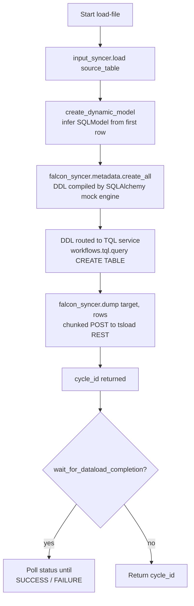

### API call sequence

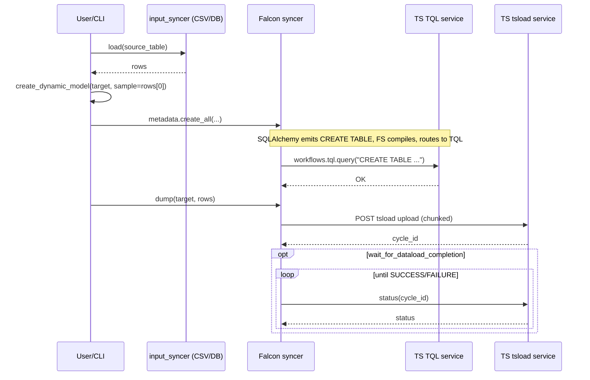

### Step-by-step

1. Read rows from any input syncer. — `syncer.load(source_table)`
2. Infer a SQLModel class from the first row's types. — `utils.create_dynamic_model(target_table, sample_row)`
3. Attach model to `falcon_syncer.metadata` and call `create_all`. The Falcon syncer uses `sa.engine.create_mock_engine` — DDL is NOT executed against a DB; it's compiled to SQL text and routed through `workflows.tql.query`. — `workflows.tql.query("CREATE TABLE ...")`
4. Bulk POST rows to the tsload REST service. Returns a `cycle_id`. — `workflows.tsload.upload(...)`
5. Poll until completion if `wait_for_dataload_completion=True`. — `workflows.tsload.wait_for_dataload_completion(cycle_id)`
6. `status CYCLE_ID` subcommand wraps the same poll; exit code 0 on SUCCESS else 1.

### Edge cases & notes

- Requires BASIC auth (trusted auth / bearer not supported for Falcon syncer).
- Default database is `cs_tools` if `--falcon-syncer` not provided.
- Type inference is naive — first-row types win; nullable columns with first-row NULL may misinfer.

### Web version — architecture decisions

**How the CLI does it today:** Takes a file from any source, infers schema, creates table in Falcon via TQL, streams rows through the tsload REST service, polls for completion.

- **A. Drag-and-drop CSV uploader** — User drops a file in the browser, preview columns, click Load. Works up to ~100MB (browser limit).
- **B. Point at a URL / S3 bucket** — User stages the file in their own storage; your service reads from the URL and streams to TS. Handles large files and async workflows.
- **C. Skip — use ETL tools instead** — Most enterprise customers already have Fivetran/Airbyte/dbt. Telling them "use that" is valid scope-cutting.

**Recommendation:** A for v1 (drag-and-drop is a great demo moment + covers ad-hoc reference data loads). Add B when someone tries to upload a 2GB file. C is valid but leaves a gap for small teams without ETL.

---

## 9. Scriptability (TML)

**Emoji:** 📦 · **Tags:** `read`, `write`, `admin`

**Purpose:** Git-like TML workflow: export TML from one environment, then import into another with automatic GUID remapping, delta imports, validate-only dry-runs, and checkpoint history.

**Plain English:** Dev-to-Prod migration tool. Export all your dashboards and worksheets from the Dev environment as files, then import them into Prod — and it automatically rewires all the IDs so things don't break. Keeps a history file so it knows what was already moved and only touches what changed.

**Why it matters:** Moving content between environments is the #1 reason customers ask for help. Doing it manually means mapping IDs by hand in YAML files — tedious and error-prone. This turns it into two commands.

### Commands

- **checkpoint** (aliases: `export`, `commit`) — Export ALL your TML (dashboards, worksheets, etc.) from one environment to a folder of text files. Also writes a "mapping file" that tracks which IDs exist in which environment and remembers what got exported when. Think `git pull` for ThoughtSpot.
- **deploy** (alias: `import`) — Import TML from a folder into another environment. The magic part: it automatically rewrites all the IDs so things don't break (a worksheet's ID in Dev is different from its ID in Prod — this fixes that). Three safety levels: `VALIDATE_ONLY` (dry-run), `ALL_OR_NONE` (atomic), `PARTIAL` (best-effort). DELTA mode only deploys files changed since last deploy.

### End-to-end flow

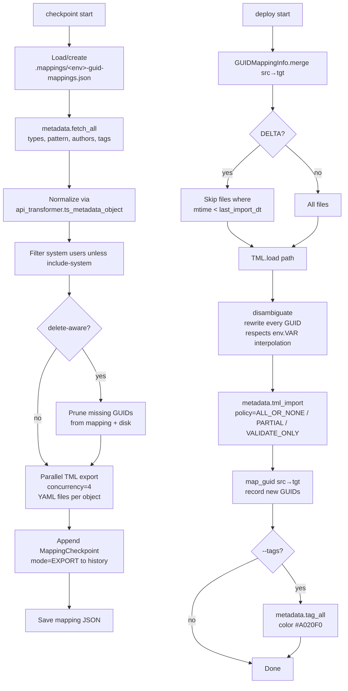

### API call sequence

```mermaid
sequenceDiagram
    participant U as User/CLI
    participant TS as ThoughtSpot REST
    participant FS as .mappings JSON file
    rect rgb(20,30,50)
      Note over U,TS: checkpoint
      U->>FS: load env-guid-mappings.json
      U->>TS: metadata.fetch_all(types, pattern, authors, tags)
      TS-->>U: objects
      par concurrency=4
        U->>TS: metadata.tml_export(guid, YAML)
        TS-->>U: TML YAML
      end
      U->>FS: write .tml files + append EXPORT checkpoint
    end
    rect rgb(30,50,20)
      Note over U,TS: deploy
      U->>FS: merge src mapping into tgt
      U->>U: TML.load + disambiguate (rewrite GUIDs)
      U->>TS: metadata.tml_import(tmls, policy)
      TS-->>U: imported objects with new GUIDs
      U->>FS: map_guid old to new, append IMPORT checkpoint
      opt --tags
        U->>TS: metadata.tag_all(new_guids, tags, color=purple)
      end
    end
```

### Step-by-step

1. `checkpoint`: load or create `.mappings/<env>-guid-mappings.json` with `{metadata, mapping (src→tgt), additional_mapping, history[]}`.
2. Fetch matching metadata with pagination. — `POST /api/rest/2.0/metadata/search`
3. Per-object TML export at concurrency=4 (more stresses Atlas). Writes `<name>.<guid>.tml` YAML files. — `POST /api/rest/2.0/metadata/tml/export (edoc_format=YAML)`
4. `--delete-aware` removes GUIDs from mapping + deletes `.tml` files absent from this export.
5. Append `MappingCheckpoint(mode="EXPORT", status, {files_expected, files_exported})` to history.
6. `deploy`: `GUIDMappingInfo.merge(src, tgt)` combines mappings; detects env mismatch.
7. DELTA mode: skip files where `mtime < last_import_dt` from history.
8. For each TML: `determine_tml_type` → `TML.load` → `disambiguate` (rewrites every GUID using `.mapping` + `.additional_mapping`; unmapped source GUIDs nulled). Respects `${{ env.VAR }}` interpolation.
9. Import as batch. — `POST /api/rest/2.0/metadata/tml/import (policy, use_async_endpoint on 10.5+)`
10. Record new target GUIDs back into mapping via `map_guid(old, new, disallow_overriding=True)`.
11. Optional: tag newly-imported content. — `workflows.metadata.tag_all(guids, tags, color=purple)`

### Edge cases & notes

- Exit codes: `0` OK, `1` ERROR, `2` WARNING.
- `VALIDATE_ONLY` policy is a server-side dry-run — nothing is imported.
- Concurrency hard-capped at 4 for TML export due to server pressure.
- History capped at 300 checkpoints (rolling).
- GUID disambiguation also handles Connection GUIDs and FQNs embedded in TML.

### Web version — architecture decisions

**How the CLI does it today:** Admin exports TML files from Dev to a local folder, then runs deploy to push them to Prod — the CLI auto-rewrites IDs using a mapping JSON file on disk.

- **A. Web migration wizard** — Pick source env, pick target env, preview the ID mapping diff, click Deploy. Store the mapping file in YOUR database, not on the user's laptop. Much safer and more discoverable than the CLI.
- **B. Git-first (deprecate this)** — Tell customers to use the Git integration instead; build this feature minimally. Simpler for you, but leaves non-Git users behind.
- **C. Both — Git for Git users, scriptability for others** — Offer both paths. Customers on GitHub use Git; customers without use the wizard.

**Recommendation:** A — the migration wizard is a top-3 admin pain point and the ID-remapping logic is where the real value lives (not the file transport). Build A well; add C later if your customer base splits.

---

## 10. Searchable ⭐ (flagship)

**Emoji:** 🔍 · **Tags:** `read`, `write`, `admin`

**Purpose:** Extract ThoughtSpot's OWN metadata (users, groups, content, columns, sharing, usage, audit, TML, AI stats) into an external database so you can "query ThoughtSpot with ThoughtSpot".

**Plain English:** Makes ThoughtSpot report on itself. Copies everything about your ThoughtSpot environment — who the users are, what content exists, who opened what, which queries were slow, who got what permissions — into a database you own. Then you can build dashboards in ThoughtSpot that answer questions like "which reports have never been opened?" or "who accessed payroll data last month?".

**Why it matters:** This is the flagship tool. Admins need to answer governance questions daily (who, what, when, why) but ThoughtSpot doesn't expose that data natively. This tool is the only way most customers get observability into their platform.

### Top-level commands

- **deploy** — Install the pre-built governance dashboards into ThoughtSpot. Tell it which warehouse will receive the extracted data (Snowflake? Databricks? Falcon?) and it rewires the dashboard's Table definitions to point there. Run once per cluster.
- **metadata** — The main snapshot. Walks through every org, every user, every group, every dashboard, every column, every permission — and copies it all to your warehouse. This is what powers 95% of governance dashboards. Run nightly. Uses a local SQLite scratch file as a staging buffer for speed.
- **bi_server** — Copy the usage log — who opened what, when, how long it took, what browser. Every page view is a row. Run this hourly if you want near-real-time "is anyone using this dashboard?" answers.
- **audit_logs** — Copy the security trail — logins, admin actions, permission changes. ThoughtSpot only retains 30 days natively, so if you need longer retention for SOC2/HIPAA compliance, schedule this daily. `--last-k-days` capped at 30.
- **tml** — Back up every dashboard/worksheet as a text file (TML). `SNAPSHOT` grabs everything every time; `DELTA` only grabs what changed since last run (so you can schedule it hourly without exploding storage). Useful for history, diffs, and disaster recovery.
- **ts_ai_stats** — Copy the query-performance log — latencies, errors, SQL that actually ran, credits consumed. Answers "why is my dashboard slow?" and "who is burning all our query credits?". Doesn't work on on-prem Falcon (the source worksheet assumes a warehouse).

### Sub-command 10a: `deploy`

**Purpose:** Install the bundled Searchable SpotApp (Liveboards + Worksheets + Tables) into the cluster. Rewrites Table TML to point at whichever external DB will receive data from `metadata` / `bi_server` / etc.

**Plain English:** Installs the pre-built governance dashboards into your ThoughtSpot. Think "install the IKEA kit" — everything is pre-assembled; you just tell it which warehouse your extracted data will land in, and it rewires itself to point there.

```mermaid
graph TD
    A[Start] --> B[metadata_search guid=cnxn_guid<br/>lookup dialect + connection name]
    B --> C[_ensure_external_mapping tml, connection_info<br/>rewrite tml.table.db/schema/db_table<br/>columns[].db_column_name]
    C --> D{Dialect}
    D -- SNOWFLAKE --> E[UPPER case names]
    D -- FALCON --> F[Null connection.name/fqn<br/>inject cluster_id in final formula]
    D -- other --> G[casefold names]
    E --> H[Skip TS_BI_SERVER.table.tml<br/>unless Falcon]
    F --> H
    G --> H
    H --> I[metadata.tml_import<br/>policy=ALL_OR_NONE timeout=900s]
```

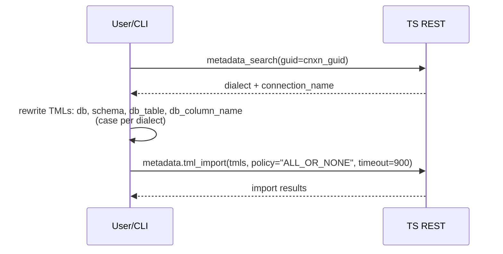

Steps:

1. Required: `--connection-guid` (or literal `"falcon"`) + `--database` + `--schema`.
2. Look up connection dialect + name. — `POST /api/rest/2.0/metadata/search`
3. Rewrite each Table TML: `db`, `schema`, `db_table`, and per-column `db_column_name`. Case rules: Snowflake UPPER, Falcon null connection, everything else casefold.
4. Non-Falcon clusters SKIP `TS_BI_SERVER.table.tml` (uses a SAGE view instead). Falcon clusters inject `cluster_id` into the view's final formula.
5. Batch import. — `POST /api/rest/2.0/metadata/tml/import (policy=ALL_OR_NONE, 15 min timeout)`
6. `--export` downloads the customized TML instead of importing.

### Sub-command 10b: `metadata`

**Purpose:** Populate 15 tables with TS metadata. Stages everything to a local SQLite (fast upserts) then streams to your final syncer.

**Plain English:** The main extract. Walks through every org, every user, every group, every dashboard/worksheet/table, every column, every permission — and copies all of it to your warehouse. This is the "inventory scan" that makes all the governance dashboards possible.

```mermaid
graph TD
    A[Start] --> B[Create temp SQLite<br/>ts.config.temp_dir/temp.db<br/>WAL + speedy pragmas]
    B --> C{for each org}
    C --> D[TS_ORG: orgs_search]
    D --> E[TS_GROUP: groups_search_v1]
    E --> F[TS_PRIVILEGE]
    F --> G[TS_USER: users_search<br/>paginator record_size=5000]
    G --> H[TS_TAG: tags_search]
    H --> I[TS_METADATA: metadata.fetch_all<br/>CONNECTION/TABLE/LIVEBOARD/ANSWER]
    I --> J[TS_COLUMN: metadata.fetch<br/>typed_guids LOGICAL_TABLE<br/>include_details=True]
    J --> K[TS_DEPENDENT: metadata.fetch<br/>typed_guids LOGICAL_COLUMN<br/>include_dependent_objects]
    K --> L[TS_ACCESS: metadata.permissions]
    L --> C
    C -- done --> M[DUMP_DATA: stream from temp<br/>batch=1M to final syncer]
    M --> N{TRUNCATE?}
    N -- yes --> O[1st batch TRUNCATE<br/>rest APPEND]
    N -- no --> P[All APPEND]
```

```mermaid
sequenceDiagram
    participant U as User/CLI
    participant TS as TS REST
    participant T as temp SQLite
    participant S as Final Syncer
    U->>T: create temp.db (WAL, speedy pragmas)
    loop per org
      U->>TS: orgs_search, groups_search_v1, users_search, tags_search
      TS-->>U: principals & tags
      U->>T: dump ts_org, ts_group, ts_user, ts_tag, ts_xref_*
      U->>TS: metadata.fetch_all(["CONNECTION","LOGICAL_TABLE","LIVEBOARD","ANSWER"])
      TS-->>U: objects
      U->>T: dump ts_data_source, ts_metadata_object, ts_tagged_object
      U->>TS: metadata.fetch(LOGICAL_TABLE, include_details=True)
      TS-->>U: columns + synonyms
      U->>T: dump ts_metadata_column, ts_column_synonym
      U->>TS: metadata.fetch(LOGICAL_COLUMN, include_dependent_objects)
      TS-->>U: dependencies
      U->>T: dump ts_dependent_object
      U->>TS: metadata.permissions(typed_guids)
      TS-->>U: ACLs
      U->>T: dump ts_sharing_access
    end
    loop read_stream(batch=1M)
      T-->>U: rows
      U->>S: dump(table, rows)
    end
```

Steps:

1. Stage to temp SQLite at `ts.config.temp_dir/temp.db` with `load_strategy=UPSERT`, `pragma_speedy_inserts=True` (WAL, synchronous=OFF, 512MB cache).
2. `TS_ORG`: `orgs_search` → `ts_org`.
3. `TS_GROUP`: `groups_search_v1` → `ts_group` + `ts_xref_principal`. — `GET /tspublic/v1/group` (v1 endpoint, not v2!)
4. `TS_PRIVILEGE`: → `ts_group_privilege`.
5. `TS_USER` (org 0 or `--org` override): paginator over `users_search`, record_size=5000, timeout=900. — `POST /api/rest/2.0/users/search`
6. `TS_TAG`: `tags_search` → `ts_tag`. — `POST /api/rest/2.0/tags/search`
7. `TS_METADATA`: `fetch_all(["CONNECTION","LOGICAL_TABLE","LIVEBOARD","ANSWER"])` filtered to current org → `ts_data_source`, `ts_metadata_object`, `ts_tagged_object`. — `POST /api/rest/2.0/metadata/search`
8. `TS_COLUMN`: fetch columns with `include_details + include_hidden_objects` → upsert `ts_metadata_object` with `data_source_guid`, fill `ts_metadata_column` + `ts_column_synonym`. — `POST /api/rest/2.0/metadata/fetch`
9. `TS_DEPENDENT`: reverse dep graph via `include_dependent_objects=True`, `dependent_objects_record_size=-1` → `ts_dependent_object`.
10. `TS_ACCESS`: permissions per typed_guids (supports `compat_ts_version`) → `ts_sharing_access` (OBJECT_LEVEL_SECURITY + optional COLUMN_LEVEL_SECURITY). — `POST /api/rest/2.0/security/metadata/permissions`
11. `DUMP_DATA`: `read_stream(tablename, batch=1_000_000)` from temp, dump to final syncer. TRUNCATE strategy flips first batch to TRUNCATE and rest to APPEND.

### Sub-command 10c: `bi_server`

**Purpose:** Extract usage events by running a search against the `TS: BI Server` system worksheet.

**Plain English:** Copies the "who opened what, when" log. Every page view, every search, every dashboard load becomes a row in your warehouse. This is how you answer "which content is actually getting used?".

```mermaid
graph TD
    A[Start] --> B{Falcon syncer?}
    B -- yes --> Z[Refuse — drop model]
    B -- no --> C[Switch to org 0<br/>multi-tenant BI Server lives there]
    C --> D[Build SEARCH TOKENS<br/>incident id, timestamp.detailed,<br/>url, response code, browser,<br/>+ filters]
    D --> E{compact?}
    E -- yes --> F[Add filter: user_action != null/invalid]
    E -- no --> G[Skip]
    F --> H[workflows.search TS: BI Server<br/>timezone=TS_BI_TIMEZONE]
    G --> H
    H --> I[syncer.dump ts_bi_server]
```

```mermaid
sequenceDiagram
    participant U as User/CLI
    participant TS as TS REST
    participant S as Syncer
    U->>U: build search tokens string + date filter
    U->>TS: switch_org(0)
    U->>TS: workflows.search("TS: BI Server", tokens, tz)
    TS-->>U: rows
    U->>S: dump("ts_bi_server", rows)
```

Steps:

1. Refuses Falcon syncer (drops the model before running).
2. Switch to org 0 — multi-tenant BI Server data lives there on SaaS/Snowflake.
3. Build TS search tokens string: `[incident id] [timestamp].'detailed' [url] [http response code] [browser type] ... [timestamp] != 'today'` with DQ filter `[incident id] != {null}`.
4. `--compact` adds `[user action] != {null} 'invalid'` filter.
5. Run the search. — `POST /api/rest/2.0/searchdata` (wrapped by `workflows.search` with `TS_BI_TIMEZONE`)
6. Warn if `--from-date` ↔ `--to-date` range exceeds 31 days.
7. Dump to `ts_bi_server`.

### Sub-command 10d: `audit_logs`

**Purpose:** Fetch last-K-days audit logs.

**Plain English:** Copies the security audit trail — logins, admin actions, permission changes — into your warehouse. ThoughtSpot only keeps 30 days; if you need longer retention for compliance, run this on a schedule.

```mermaid
graph TD
    A[Start] --> B[Compute utc_terminal_end<br/>NOW / TODAY_START_UTC / TODAY_START_LOCAL]
    B --> C{for days in range --last-k-days 1..30}
    C --> D[logs_fetch utc_start, utc_end<br/>one-day window]
    D --> C
    C -- done --> E[api_transformer.ts_audit_logs]
    E --> F[syncer.dump ts_audit_logs]
```

```mermaid
sequenceDiagram
    participant U as User/CLI
    participant TS as TS REST
    participant S as Syncer
    loop per day (up to --last-k-days)
      U->>TS: POST /api/rest/2.0/logs/fetch (utc_start, utc_end)
      TS-->>U: events
    end
    U->>U: normalize via api_transformer.ts_audit_logs(cluster=CLUSTER_UUID)
    U->>S: dump("ts_audit_logs", rows)
```

Steps:

1. `--last-k-days` in `[1,30]` — TS retains 30 days of audit.
2. `--window-end` controls where "now" is: `NOW | TODAY_START_UTC | TODAY_START_LOCAL`.
3. Loop day-by-day. — `POST /api/rest/2.0/logs/fetch (utc_start, utc_end)`
4. Normalize through `api_transformer.ts_audit_logs` with `cluster_guid` stamped in.
5. Dump to `ts_audit_logs`.

### Sub-command 10e: `tml`

**Purpose:** Snapshot all TML into a syncer for history/diffing/backup.

**Plain English:** Backs up every dashboard and worksheet as a text file ("TML"). If something breaks or gets deleted, you have a history. "DELTA" mode only backs up what changed since last time, so you can run it hourly without exploding storage.

```mermaid
graph TD
    A[Start] --> B[Create temp SQLite]
    B --> C{for each org}
    C --> D[metadata.fetch_all --metadata-type]
    D --> E[Filter subtype]
    E --> F{DELTA?}
    F -- yes --> G[SELECT MAX modified FROM ts_metadata_tml<br/>drop unchanged]
    F -- no --> H[All objects]
    G --> I[Parallel tml_export<br/>concurrency=4<br/>V2 for MODEL / V1 else]
    H --> I
    I --> J[api_transformer.ts_metadata_tml<br/>edoc_format + cluster_id + org_id]
    J --> K[Dump to temp.ts_metadata_tml]
    K --> C
    C -- done --> L[Stream temp → final syncer]
```

```mermaid
sequenceDiagram
    participant U as User/CLI
    participant TS as TS REST
    participant T as temp SQLite
    participant S as Final Syncer
    loop per org
      U->>TS: metadata.fetch_all(types)
      TS-->>U: objects
      opt DELTA
        U->>T: SELECT MAX(modified)
        T-->>U: last snapshot
      end
      par concurrency=4
        U->>TS: metadata.tml_export(guid, V2 if MODEL, edoc_format=JSON/YAML)
        TS-->>U: TML blob
      end
      U->>T: dump("ts_metadata_tml", rows)
    end
    U->>S: stream from temp to final syncer
```

Steps:

1. `--metadata-type`: `MODEL | LIVEBOARD` (hidden: `CONNECTION, TABLE, VIEW, SQL_VIEW, ANSWER`).
2. `--strategy DELTA|SNAPSHOT`. DELTA only if using a `DatabaseSyncer` (needs `MAX(modified)`).
3. `--tml-format JSON|YAML`. `--directory` optionally writes raw TML files on disk too.
4. Per object export with `schema_version V2` for MODEL, V1 else. — `POST /api/rest/2.0/metadata/tml/export`
5. Parallel export at concurrency=4 (Atlas-safe).
6. `api_transformer.ts_metadata_tml` stamps cluster/org + format.
7. Stream to final syncer as `ts_metadata_tml`.

### Sub-command 10f: `ts_ai_stats`

**Purpose:** Same mechanism as `bi_server` but against the `TS: AI and BI Stats` worksheet — richer perf/AI data.

**Plain English:** Copies query performance data — how long each query took, which ones errored, which models they hit, how many "credits" they burned. Answers "why is my dashboard slow?" and "who is driving up our query costs?".

```mermaid
graph TD
    A[Start] --> B{Falcon?}
    B -- yes --> Z[Refuse]
    B -- no --> C[Build large SEARCH TOKENS<br/>DB latency, model, connection,<br/>SQL query, credits, trace id,<br/>~30 columns]
    C --> D[workflows.search TS: AI and BI Stats]
    D --> E[syncer.dump ts_ai_stats]
```

```mermaid
sequenceDiagram
    participant U as User/CLI
    participant TS as TS REST
    participant S as Syncer
    U->>TS: workflows.search("TS: AI and BI Stats", tokens, tz)
    TS-->>U: rows (~30 columns)
    U->>S: dump("ts_ai_stats", rows)
```

Steps:

1. Refuses Falcon syncer.
2. Large token set covering `answer_session_id`, `query_latency`, `system_latency`, `connection`, `db_type`, `error_message`, `sql_query`, `credits`, `trace_id`, `user_action`, etc.
3. Run search. — `POST /api/rest/2.0/searchdata`
4. Dump to `ts_ai_stats`.

### Edge cases & notes (Searchable)

- 17-table schema; every model has `cluster_guid` in composite PK for multi-cluster installs.
- Normalizations: `user_action`/`client_type` UPPERCASED, `url`/`browser_type` lowercased, `dbms_type` strips `RDBMS_` prefix (DEFAULT → FALCON), `index_priority` clamped 1–10.
- TRUNCATE load strategy: first stream batch TRUNCATEs, rest APPEND — so a multi-batch dump doesn't wipe itself.
- `TS_COLUMN` uses `include_hidden_objects=True` to catch system columns.
- `bi_server` and `ts_ai_stats` refuse Falcon syncer since those worksheets assume external warehouse storage.

### Web version — architecture decisions

**How the CLI does it today:** Admin runs on their laptop; CLI extracts 17 tables of TS metadata and writes to a customer-owned warehouse (Snowflake, Databricks, etc.) via Syncers.

- **A. Downloads only** — Export each table as CSV. Customer loads into their warehouse themselves (or just opens in Excel). Zero warehouse integration on your end.
- **B. Built-in governance dashboards** ⭐ — Store the metadata in YOUR database and render the governance dashboards inside your web app. Customer never needs a warehouse; they just see the answers. Owning storage = owning the insights.
- **C. Full syncer parity** — Support customer-owned Snowflake/Databricks/etc. — requires handling their warehouse credentials (security work).

**Recommendation:** B is the killer feature. Customers don't want tables, they want answers ("which dashboards are unused?" / "who accessed payroll?"). Owning the storage lets you own the dashboards. Add A as an export-to-CSV option. Add C only for enterprise customers who insist on warehouse ownership — much later.

---

## 11. User Management

**Emoji:** 👥 · **Tags:** `read`, `write`, `delete`, `admin`

**Purpose:** Bulk ownership transfers, shared-with ACL copies, and user deletion. (Principal sync is implemented but currently disabled.)

**Plain English:** The offboarding toolkit. When someone leaves the company: transfer all their dashboards/reports to a new owner, copy all their sharing permissions to their replacement, and then bulk-delete their account. Also has a (disabled) feature to sync users from HR systems.

**Why it matters:** Every departure creates orphaned content ("who owns this now?"). Doing the cleanup in the UI takes hours; this reduces it to minutes and gives the replacement the same access their predecessor had.

### Commands

- **transfer** — Change WHO OWNS things. "Everything currently owned by alice@co.com should now be owned by bob@co.com." The dashboards don't move, their owner field just gets updated. Optionally filter by content type, tag, or exact GUID list so you don't move everything blindly.
- **transfer-sharing** — Copy WHO CAN SEE what Alice could see to Bob. If Alice had Read access to 47 dashboards, Bob now has Read access to the same 47. Useful when someone joins a team and needs the same visibility as a peer. Optionally emails Bob on every share (`--notify`). Refuses to target admins (who already see everything).
- **delete** — Admin-only. You provide a spreadsheet of users to delete. It confirms (60-second timeout), then deletes them all — retrying up to 10 times per user if the API hiccups. This is your offboarding bulk action.
- **sync** — DISABLED right now (says "getting an upgrade" and exits). Designed to sync users from an external system (like your HR directory): create new users, update changed ones, remove departed ones. `--delete-mode HIDE|REMOVE|IGNORE` decides what to do with users not in the source anymore — HIDE moves them to a hidden group instead of deleting.

### End-to-end flow

```mermaid
graph TD
    A[Start] --> B{Command?}

    B -- transfer --> C[Paginate metadata_search<br/>filter authorName == from_username]
    C --> D[Per GUID concurrency=15<br/>security_metadata_assign<br/>user_identifier=to_username]

    B -- transfer-sharing --> E[Validate target is not admin]
    E --> F[security_principal_permissions<br/>per content type]
    F --> G[_transform_shared to rows]
    G --> H[syncer.dump ts_transfer_metadata_permission]
    H --> I[Confirm 60s]
    I --> J[Per row<br/>security_share_content<br/>to_user + notify_on_share]

    B -- delete --> K[Require is_admin]
    K --> L[syncer.load deletion]
    L --> M[Confirm]
    M --> N[Retry-to-10 delete loop<br/>users_delete concurrency=15]
```

### API call sequence

```mermaid
sequenceDiagram
    participant U as User/CLI (admin)
    participant TS as TS REST
    participant S as Syncer
    rect rgb(20,40,20)
      Note over U,TS: transfer ownership
      U->>TS: metadata.search paginated (+filter by authorName)
      TS-->>U: objects owned by from_user
      par concurrency=15
        U->>TS: security_metadata_assign(guid, user_identifier=to_user)
      end
    end
    rect rgb(40,30,20)
      Note over U,TS: transfer-sharing
      U->>TS: security_principal_permissions(from_user, USER, type)
      TS-->>U: who-can-see-what
      U->>S: dump("ts_transfer_metadata_permission", rows)
      U->>U: confirm (60s)
      loop per row
        U->>TS: security_share_content(to_user, type, message, object, mode, notify)
      end
    end
    rect rgb(40,20,20)
      Note over U,TS: delete
      U->>S: load(deletion_directive)
      S-->>U: user_guid or username rows
      loop while set not empty
        par concurrency=15
          U->>TS: users_delete(user_identifier)
          alt OK or attempts>10
            Note over U: discard from set
          end
        end
      end
    end
```

### Step-by-step

1. `transfer`: paginate matching metadata, filter by `authorName == from_username`. Friendly types map: `TABLE→ONE_TO_ONE_LOGICAL`, `VIEW→AGGR_WORKSHEET`, `MODEL→WORKSHEET`. — `POST /api/rest/2.0/metadata/search`
2. Per GUID assign to new owner. — `POST /api/rest/2.0/security/metadata/assign`
3. `transfer-sharing`: fetch what the source user shared. — `POST /api/rest/2.0/security/principal/permissions`
4. Flatten via `_transform_shared` into `{principal_id, principal_name, metadata_type, metadata_id, metadata_name, permission}`.
5. Dump to syncer (`ts_transfer_metadata_permission` table).
6. 60-second confirm (keyboard listener with tick-tock progress).
7. Per row, share the object to the target user. — `POST /api/rest/2.0/security/share (share_mode=permission, notify_on_share)`
8. `delete`: admin-only. `syncer.load` returns rows with `user_guid` or `username`.
9. Retry-to-10 delete loop at concurrency=15. — `POST /api/rest/2.0/users/delete`
10. `sync` (disabled): designed to diff external principals against TS — shares transformers with `searchable`, computes `(created, updated, deleted)` via pydantic `__hash__`, supports `--delete-mode HIDE|REMOVE|IGNORE`.

### Edge cases & notes

- `transfer-sharing` refuses to target an admin.
- Retry-to-10 pattern mirrors `bulk-deleter`.
- `sync` is intentionally short-circuited right now — it logs "getting an upgrade" and returns.
- HIDE delete-mode moves users to a HIDDEN non-shareable group instead of deleting.

### Web version — architecture decisions

**How the CLI does it today:** Admin runs `transfer`/`transfer-sharing`/`delete` commands from the CLI; each one prompts for a 60-second keyboard confirm before applying.

- **A. Interactive offboarding flows** — Pick the leaver, pick the replacement, preview everything that will change (ownership, sharing, deletion), confirm once. Daily-driver UX for HR/IT admins.
- **B. HR system integration (Okta / Azure AD)** — Webhook from your identity provider automatically triggers the offboarding. No admin action needed.
- **C. Bulk CSV upload** — Upload a spreadsheet of user changes from HR. Handles bulk events like layoffs or acquisitions cleanly.

**Recommendation:** A + C for v1. A is the daily driver; C handles bulk events. B (HR integration) is an enterprise v2 feature with real engineering cost — wait until a customer asks.

---

## 12. Syncers (I/O layer)

**Emoji:** 🔌 · **Tags:** `read`, `write`

**Purpose:** The pluggable output/input layer used by every tool. URI-addressable (`csv://...`, `snowflake://...`). 14 concrete syncers from CSV to Databricks — plus a clever "Falcon" syncer that routes SQLAlchemy DDL through the TQL REST API.

**Plain English:** The plug adapters. Every other tool needs somewhere to put its output — CSV file, Excel sheet, Google Sheet, Snowflake warehouse, Databricks, Postgres, etc. Syncers are the adapters that let any tool write to any destination. You pick the destination at runtime with one argument; the tool itself doesn't care where the data goes.

**Why it matters:** This is the single most valuable architectural idea in CS Tools. Without syncers, every new destination would require code changes to every tool. With syncers, adding a new warehouse type (say, MotherDuck) is a one-file drop-in — and every existing tool instantly supports it.

### Commands

- **Syncer (base)** — The contract every destination must follow. Only two methods: `load(directive)` (read rows from the source) and `dump(directive, data)` (write rows to the destination). That's the whole interface — tools don't care what's behind it. Pick a destination at runtime with one CLI argument.
- **DatabaseSyncer** — A specialized Syncer for when the destination is a database (not a flat file). Adds automatic table creation (first run creates the schema), an ORM session, and three write modes: `APPEND` (add new rows), `TRUNCATE` (wipe then write), `UPSERT` (merge on key — update existing, insert new). Every DB backend (Snowflake, Postgres, Databricks, etc.) inherits from this.

### End-to-end flow

```mermaid
graph TD
    A[Tool calls --syncer csv://...] --> B[cs_tools.cli.custom_types.Syncer<br/>parse URI / toml file]
    B --> C[Read MANIFEST.json<br/>pip requirements]
    C --> D[cs_tools_venv.install deps<br/>skipped in CI]
    D --> E[importlib.util<br/>spec_from_file_location]
    E --> F[Instantiate class<br/>pydantic validates kwargs<br/>models list passed in]
    F --> G[__finalize__ hook]
    G --> H{DatabaseSyncer?}
    H -- yes --> I[to_metadata for each model<br/>metadata.create_all engine<br/>open ORM session]
    H -- no --> J[Ready]
    I --> J
    J --> K[Tool invokes<br/>syncer.dump target, data<br/>or<br/>syncer.load directive]
    K --> L[Concrete backend:<br/>csv/excel/parquet/json/gsheets/<br/>sqlite/postgres/snowflake/redshift/<br/>databricks/bigquery/starburst/trino/falcon]
```

### API call sequence

```mermaid
sequenceDiagram
    participant U as User (--syncer URI)
    participant CT as custom_types.Syncer
    participant V as cs_tools venv
    participant M as Manifest + Class
    participant DB as Backend
    U->>CT: --syncer protocol://k=v&...
    CT->>CT: parse URI or toml
    CT->>M: read MANIFEST.json
    CT->>V: install pip deps (first use)
    CT->>M: spec_from_file_location + load class
    CT->>M: Class(**kwargs, models=[...])
    M->>M: pydantic validate
    M->>M: __finalize__()
    opt DatabaseSyncer
        M->>DB: metadata.create_all (auto-provision tables)
        M->>DB: open ORM session
    end
    U->>M: syncer.dump(target, data)
    M->>DB: write rows (strategy: APPEND/TRUNCATE/UPSERT)
```

### Step-by-step

1. Every syncer ships as `cs_tools/sync/<name>/` with `MANIFEST.json` + `syncer.py`.
2. `MANIFEST.json` declares pip requirements installed into the cs_tools venv on first use (skipped in CI).
3. Loaded via `importlib.util.spec_from_file_location`.
4. Base class: pydantic settings model (`extra="forbid"`). Subclasses must set `__syncer_name__` + `__manifest_path__`. `__init_subclass__` wraps `__init__` so `__finalize__` runs post-init.
5. Protocol: `load(directive) → list[dict]`, `dump(directive, data) → None`.
6. `DatabaseSyncer` adds: `metadata` (`sqlmodel.MetaData`), `models` list, `load_strategy`, `_engine`. On finalize: `model.__table__.to_metadata(metadata, schema=None)` for each model, then `metadata.create_all`. Opens an ORM session.
7. Flat-file syncers: `csv`, `excel`, `gsheets`, `json`, `parquet`, `mock`.
8. Database syncers: `sqlite`, `postgres`, `snowflake`, `redshift`, `databricks`, `bigquery`, `starburst`, `trino`.
9. SQLite specifics: `pragma_speedy_inserts` sets `journal_mode=WAL`, `synchronous=OFF`, `cache_size=-500000` (~512MB), `locking_mode=EXCLUSIVE`, `temp_store=MEMORY`. Reads `PRAGMA compile_options` for `MAX_VARIABLE_NUMBER` to size batches. UPSERT uses `INSERT OR REPLACE`.
10. Snowflake: auth modes `basic | key-pair | sso | oauth`. Validates regionless privatelink URLs.
11. Falcon syncer: `sa.engine.create_mock_engine("sqlite://", sql_query_to_api_call)`. SQLAlchemy emits DDL → compiled to SQL string → routed through `workflows.tql.query`. Bulk dumps go through the tsload REST service. Requires BASIC auth.
12. CSV options: `directory`, `delimiter` (default `|`), `escape_character`, `empty_as_null`, `quoting {ALL|MINIMAL}`, `date_time_format`, `header`, `save_strategy {APPEND|OVERWRITE}`.

### Edge cases & notes

- `load_strategy` validation is case-insensitive.
- Most DB syncers implement `read_stream(tablename, batch)` for paged reads — used by `searchable`'s staging pattern.
- Tool commands pass `models=[...]` kwarg so the DB syncer knows which tables to provision.
- Falcon syncer NEVER actually connects to SQLite — the string is a sentinel for the mock engine.

### Web version — architecture decisions

**How the CLI does it today:** The CLI runs on the admin's laptop; they supply warehouse credentials on the command line, and the CLI connects directly to Snowflake/Databricks/etc. Credentials never leave their machine.

- **A. Downloads only (safest)** — Your web app gives users CSV/Excel/JSON/Parquet downloads. They upload to their warehouse themselves. You never touch Snowflake or Databricks. No credential storage, minimal security burden.
- **B. User-owned connections (middle ground)** — User enters warehouse credentials in your UI; you store them encrypted; your backend connects on their behalf. Full automation, but you now carry big security responsibility (encryption at rest, audit, rotation, SOC2).
- **C. Customer-installed agent (enterprise)** — Ship a small Docker container or CLI they install inside their VPC; your web app sends instructions, the agent runs them locally. Credentials never leave the customer's environment.

**Recommendation:** A for v1 — no security liability, fastest to ship. Add C for enterprise customers who need automation into their warehouse but don't want to hand you credentials. Skip B unless you're specifically building a credential-trust product — the security work is significant and the risk is real.
